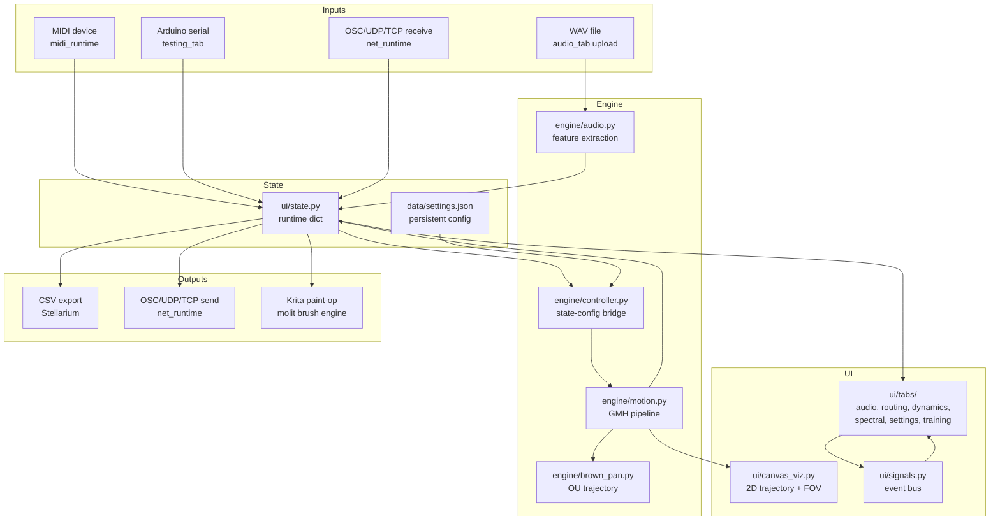

# Architecture Overview

## The ecosystem

This repo contains two related but independent projects:

| Project | Location | Role |
|---|---|---|
| **slum** (sonolumos_v3) | `sonolumos_v3/` | Audio → motion engine and UI |
| **44** | `docs/reaper/` | Reaper sample tool — generates audio inputs for slum |

44 curates and segments large audio libraries into WAV clips. Those clips feed slum as audio
inputs for feature extraction, training, or live motion. See `[[05_integration/44_reaper]]`.

---

## Slum: what it does

Slum transforms audio into parametric spatial motion. It maps features extracted from sound
(energy, spectral character, transience) into motion curves (field-of-view, azimuth, altitude)
through a physics-inspired signal chain. Those curves drive external systems: Stellarium
(astronomical visualization), Krita (motion-driven painting), serial motors, or any OSC/UDP
receiver.

The motion is not a filter or effect on audio — it is a new signal derived from audio structure.

---

## System map



---

## Signal chain (audio → motion)

```
Audio file (WAV)
  → analyze_audio()          RMS, centroid, flux, ZCR, band RMS
  → features_to_dict()       named arrays at audio hop FPS
  → build_motion_from_state()  apply routing config from state
      → Geometry (G)         capacitor / inductor / mixed shaping
      → Medium (M)           viscoelastic spring/damping dynamics
      → Hysteresis (H)       lag, memory, asymmetric response
      → FOV blend            weighted G/M/H → fov_final_norm
      → Brownian pan (opt)   OU 2D trajectory driven by energy
      → Curve 256 (opt)      256-point LUT on fov_final_norm
      → Unit mapping         norm → degrees [min_y, max_y]
      → FOV mode gains       perceptual scale by FOV bucket
  → motion dict              {fov, az, alt, dx, dy, taps, ...}
  → outputs                  CSV / OSC / canvas / Krita
```

---

## Responsibilities by layer

| Layer | Concern |
|---|---|
| `ui/tabs/` | Render views, collect input, fire signals |
| `ui/state.py` | Single mutable runtime dict (source of truth) |
| `ui/signals.py` | Loose coupling between tabs (publish/subscribe) |
| `engine/audio.py` | Feature extraction from raw PCM |
| `engine/controller.py` | Translate flat state dict → typed engine config |
| `engine/routing.py` | Per-parameter GMH processing + FOV blending |
| `engine/motion.py` | Full pipeline: features → motion dict |
| `engine/brown_pan.py` | Stochastic trajectory (Ornstein-Uhlenbeck) |
| `engine/temporal.py` | FPS, resampling, aliasing, velocity layer |
| `engine/shaping.py` | Normalization and curve helpers |
| `engine/domains.py` | Value constraint (wrap / clamp) |
| `engine/namespace.py` | Canonical signal key scheme |
| `engine/nodes/` | Planned node protocol (transition layer) |
| `engine/midi_runtime.py` | MIDI CC/note → state key mapping |
| `engine/net_runtime.py` | OSC/UDP/TCP motion dispatch |
| `training/runner.py` | DEAP-based GMH parameter optimization |

---

## Three architectural layers (current vs planned)

### Now: flat state + controller
UI writes to `state[key]`. `build_motion_from_state()` reads all keys at once and passes
them as a RoutingConfig to the engine. The engine emits short flat tap keys (`fov.g`, `fov.h`).

### Planned: node protocol + namespaces
Each GMH stage becomes a `Node` (see `[[04_engine/nodes_and_namespaces]]`). Nodes emit
namespaced taps (`geometry.fov.out`, `medium.az`, `output.fov`). State is typed and validated
at the model layer, not as a raw dict. UI becomes a thin client.

### Why it matters for streaming
The flat-array batch model must become a stateful per-frame model for live audio input.
The node protocol (`apply(x, ctx, taps)`) is designed to work in both batch and streaming
modes with the same interface.

---

## Key files
- `ui/app.py` — entry point, tab wiring, timer setup
- `ui/state.py` — runtime state dict
- `engine/controller.py` — bridge from state to engine
- `engine/motion.py` — full motion pipeline
- `engine/routing.py` — per-parameter GMH routing
- `engine/audio.py` — feature extraction

## Related docs
- `[[01_architecture/gmh_phase_model]]` — philosophy of the G/M/H stages
- `[[01_architecture/backend_separation_roadmap]]` — path toward a thin UI
- `[[04_engine/nodes_and_namespaces]]` — the transition architecture
- `[[05_integration/44_reaper]]` — the 44 audio input tool
- `[[01_architecture/audio_streaming_pipeline]]` — live audio input design
