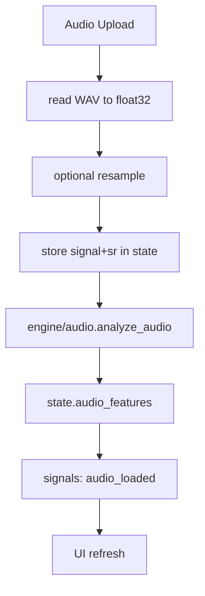

# Audio Pipeline

## Summary
Audio upload reads a WAV into memory, optionally resamples, stores it in state, then runs feature extraction in a background thread. Results are saved to state and notify subscribers.

## Flow

## Steps
1) `audio_tab.handle_audio_upload` reads file bytes and decodes WAV.
2) Optional resample based on Settings.
3) Store `audio_signal`, `audio_sr`, `audio_name` in state.
4) `analyze_audio` computes frame-based features.
5) Store `audio_features` and publish `audio_loaded`.

## Key files
- ui/tabs/audio_tab.py
- engine/audio.py
- ui/state.py
- ui/signals.py

## Notes
- The full audio is loaded into memory; large files can spike RAM.
- Waveform display is now a downsampled envelope rendered on canvas.
