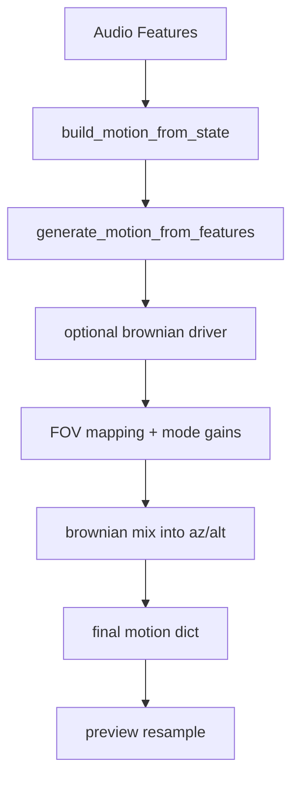

# Motion Pipeline

## Summary
Motion is generated from audio features and routing config. Brownian pan can generate a structured trajectory and later mix into az/alt (modifier or full override). Outputs are resampled for UI preview.

## Flow

## Key stages
- `engine/routing.generate_motion_from_features`: applies per-route geometry, medium, hysteresis, and FOV blending.
- `engine/motion.build_motion`: builds features on the motion timeline, applies domain shaping, generates brownian paths, maps FOV to degrees, applies FOV gains, and mixes brownian into az/alt.
- `engine/controller.build_motion_from_state`: bridges state into routing config and motion build.

## Stage details
### Geometry (G)
- Input is normalized: subtract mean and scale to max abs for a stable -1..1 range.
- Pre-smoothing applies exponential smoothing using `smoothing`.
- Capacitor path: leaky integrator. `cap_alpha` controls charge speed, `cap_leak` controls decay.
- Inductor path: derivative with momentum. `ind_beta` sets response to change, `ind_gamma` sets persistence.
- Mix: `mix_weight` blends capacitor (0.0) to inductor (1.0).

### Medium (M)
- Treats the geometry output as a moving center and integrates a position/velocity system.
- Elasticity is a spring toward the input curve; viscosity damps velocity.
- Turbulence is driven by high-frequency residual of the input (input minus smoothed).
- Field strength adds a constant bias force; `field_angle_deg` controls its direction.
- `dt` and `dt_ref` scale the forces so behavior is stable across fps.

### Hysteresis (H)
- Tracks the gap between input and output using an internal memory state.
- `memory` sets how strongly the gap is stored. `decay` sets how fast it fades.
- `threshold` ignores small deltas. `loop_width` biases rising vs falling response.
- `gain` scales the output. Parameters are rescaled relative to `REF_FPS`.

### Routing outputs
- Non-FOV routes apply `scale + offset` after hysteresis, store `*_raw`, then wrap/clamp (azimuth wrap, altitude clamp).
- FOV creates normalized overlays: `fov_geom_norm`, `fov_medium_norm`, `fov_hyst_norm`.
- `fov_final_norm` is a weighted blend of G/M/H (`fov_blend_g/m/h`), then optional aliasing (`alias_fps`).
- Domains (if configured) are applied after routing and before FOV mapping.

### Temporal / FOV post
- Optional gaussian smoothing can be applied after FOV aliasing.
- `fov_final_norm` maps to degrees using `temporal_min_y` and `temporal_max_y`.
- FOV mode gains bucket FOV into molecular/deep_space/constellations/sky and modulate FOV and base az/alt.
- Thresholds (deg): molecular <= 2.6, deep_space <= 6.18, constellations <= 160, else sky.
- Gains (fov, pan): molecular (0.4, 0.1), deep_space (0.6, 0.4), constellations (1.2, 0.7), sky (0.9, 0.9).
- A soft-floor limiter prevents FOV collapsing too close to 0 degrees.

### Brownian mix
- Brownian driver is computed before unit mapping, but mixed after FOV gains.
- Mixed values are written to `dx/dy`, `az_raw/alt_raw`, then wrapped/clamped to `az/alt`.

## Parameter tuning (phase 1)
Use these as directional cues for selecting ranges, not fixed targets.

### Geometry (cap/ind/mix)
- `cap_alpha`: higher = faster charge (tracks input more quickly), lower = slower drift.
- `cap_leak`: higher = shorter memory (faster decay), lower = longer integration.
- `ind_beta`: higher = more sensitive to change (stronger derivative response).
- `ind_gamma`: higher = longer persistence of momentum.
- `smoothing`: higher = softer, less noisy curves; lower = more raw detail.
- `mix_weight`: 0 → capacitor-dominant (stable), 1 → inductor-dominant (responsive).

### Medium (viscoelastic)
- `elasticity`: higher = stronger pull back to input (tighter structure).
- `viscosity`: higher = more damping (slower motion, less oscillation).
- `turbulence`: higher = more high-frequency motion; keep low while structuring.
- `field_strength`: constant bias; use sparingly to avoid drift.

### Hysteresis (memory)
- `memory`: higher = longer retention of past deviation (more lag/echo).
- `decay`: higher = faster forgetting (less long-term bias).
- `threshold`: higher = ignore small deltas (cleaner, less jitter).
- `loop_width`: biases rising vs falling response (use small values for symmetry).
- `gain`: global amplitude; avoid using gain to compensate for weak structure.

### Brownian trajectory
- `brown_step_scale`: step length; increase to widen the path.
- `brown_turn_rate_deg`: curvature; higher values make tighter turns.
- `brown_inertia`: higher = smoother, more inertial drift.
- `brown_smooth_s`: temporal smoothing of the driver.
- `brown_mix`: 0 = no trajectory injection, 1 = full override.

### Phase blending (FOV)
- `fov_blend_g/m/h`: reweight GMH contributions before mapping to degrees.
- Keep weights normalized (sum ~ 1) so phase balance stays interpretable.

## Outputs
- Required: `fov`, `az`, `alt`.
- Debug: `fov_*_norm`, `az_raw`, `alt_raw`, `brown_*`, `spectral_flux`.

## Key files
- engine/controller.py
- engine/routing.py
- engine/motion.py
- engine/temporal.py
### Feature alignment
- Audio features are interpolated onto the motion timeline (`duration_s` × `fps`).
- Per-route feature curves are resampled to an exact `n_frames` so routing outputs stay time-aligned.
