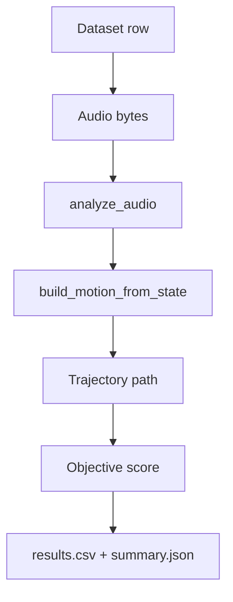
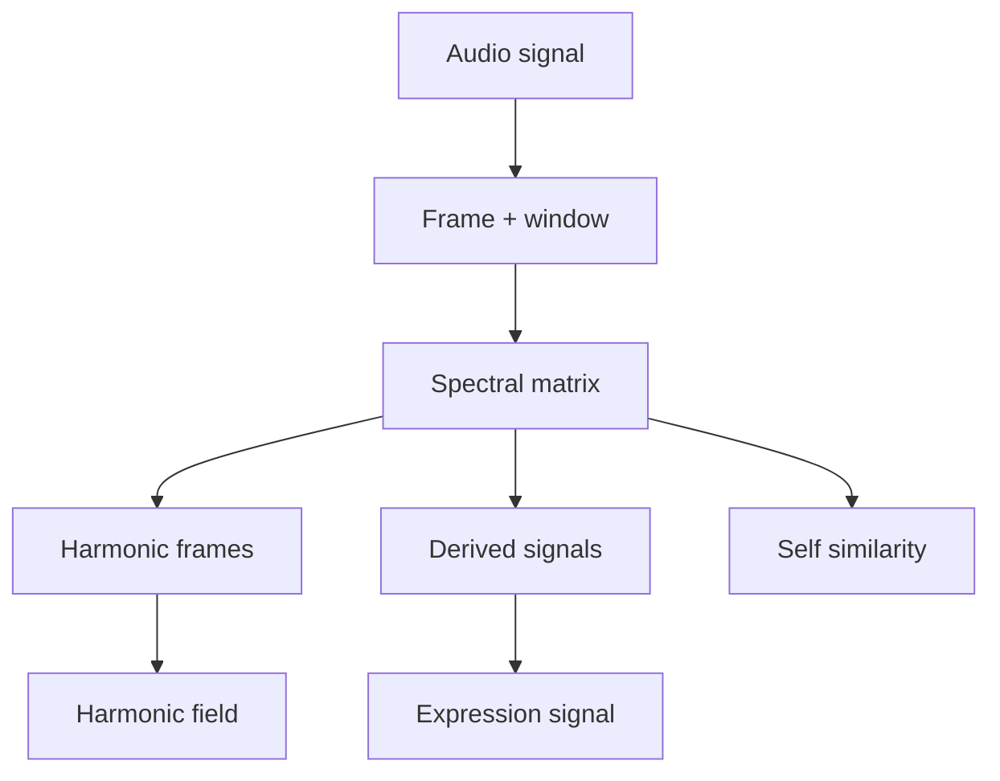

# Network Topology

## Summary
This map describes how audio, features, routing, motion generation, UI overlays, and training flow through the app. It is a topology view of sources and targets, not a timing diagram.


## Topology map
```mermaid
graph TD
  AudioUpload[Audio upload] --> Decode[Decode/resample]
  Dataset[Training dataset rows] --> Decode

  Decode --> Analyze[engine/audio.analyze_audio]
  Analyze --> Features[features_to_dict + extra packets]

  Features --> Routing[engine/routing.generate_motion_from_features]
  Routing --> Motion[engine/motion.build_motion]
  Motion --> Brown[engine/brown_pan (optional)]
  Brown --> Outputs[Motion dict (fov/az/alt + debug)]

  Outputs --> UIOverlays[Canvas overlays + graph controls]
  Outputs --> Export[CSV/Canvas export]
  Outputs --> NetTransport[engine/net_transport]
  NetTransport --> External[External clients (OSC/UDP/TCP)]

  Settings[Settings / state] --> Controller[engine/controller.build_motion_from_state]
  Controller --> Routing

  NetworkUI[Network tab] -->|apply routes| Settings
  Packets[Energy packets (Settings → Network)] --> Features

  SpectralUI[Spectral tab] --> Analyze
  SpectralUI --> SpectralViews[Spectral frames + signals + field]

  Training[Training tab] --> Analyze
  Training --> Motion
  Training --> Scoring[Trajectory score]
  Training --> Runs[output/training_runs]
```


## Flow notes
- The **routing config** is built from `state` and drives how features map into FOV/Az/Alt.
- **Energy packets** are additional feature channels (band RMS) and become routable nodes.
- **Brownian** can mix into az/alt after routing, acting as a modifier or full override.
- **UI overlays** render from `state["last_motion"]` and `state["last_taps"]` (preview resampled).
- **Training** reuses the same analysis + motion path, then scores trajectories.
- **Spectral** is analysis-first and currently lives as a parallel analysis view.
- **Net transport** can stream motion or events to external clients via OSC/UDP/TCP.


## Training path (detail)



## Spectral path (detail)



## Key files
- `ui/tabs/audio_tab.py`
- `ui/tabs/routing_tab.py`
- `ui/tabs/dynamics_tab.py`
- `ui/tabs/training_tab.py`
- `ui/tabs/spectral_tab.py`
- `engine/audio.py`
- `engine/routing.py`
- `engine/motion.py`
- `engine/brown_pan.py`
- `engine/net_transport.py`
