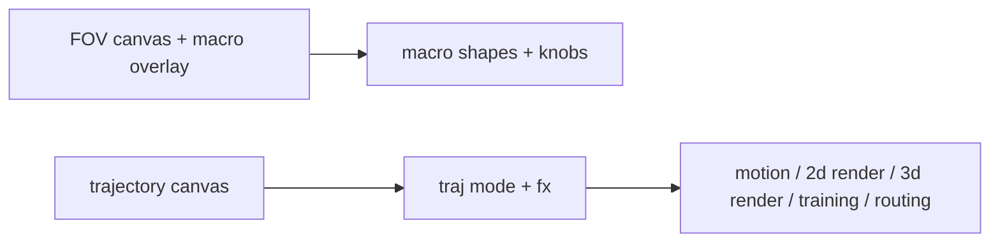

# Dynamics Tab

## Purpose
Main visualization and live control surface: FOV canvas, macro overlay, trajectory canvas, render controls, and brownian controls.

## Layout map

## Key behaviors
- Motion refresh throttles during drag (preview) and full rebuild after commit.
- Trajectory canvas supports xy, polar, sphere, cart, and delay-embedding modes.
- Trajectory view can switch the FOV source (geometry, medium, temporal, final).
- Brownian controls include source, mode (OU/legacy), and mix (modifier vs override).
- Dynamics subtabs separate motion controls from render/routing/training surfaces.
- Seed pole (8x8 sweep rendered in polar) + entropy scatter sit under routing, showing fractal scores and current spatial occupancy.
- Seed pole uses the fractal score (entropy + box-count) for fixed params and a seed sweep.

## Trajectory modes (current)
- `xy`: uses `dx/dy` when available, otherwise `az/alt` (or `*_raw` if present).
- `polar`: treats `x` as angle in degrees and `y` as radius.
- `cart`: converts az/alt (degrees → radians) plus FOV radius into `cart_x/cart_y/cart_z`.
- `delay`: delay-embedding of the selected FOV source (`x = s[t]`, `y = s[t - tau]`), default `tau = 0.5s`.

## Entropy / fractal scoring (preview)
- Entropy uses a 2D histogram over normalized `x/y` (24x24 bins), normalized by max entropy.
- Fractal score blends entropy (0.5) with box-count dimension over scales (4, 8, 16).

## 3D render implementation plan (WIP)
Goal: render sphere/cart modes with a real 3D plot, controlled by an explicit 2D/3D toggle.

1) **Data prep**
   - Build `x/y/z` from `cart_*` (or raw series when `cart_*` is missing).
   - Collect emitter points as a separate scatter layer (optional).
   - Apply decimation and point caps for preview safety.

2) **Renderer**
   - Use Plotly `Scatter3d` with a line trace for the trajectory.
   - Optional scatter trace for emitters (size/alpha from render config).
   - Color mapping from selected driver (FOV/geom/medium/temporal).

3) **Controls**
   - Toggle to switch 2D vs 3D view (3D only updates when toggle is on).
   - Use the existing preview FPS to throttle 3D re-renders.
   - 3D-specific settings live in Preferences → 3D render.

4) **Integration**
   - `dynamics_tab.py`: add a 3D plot container and update functions.
   - `canvas_viz.py`: keep 2D canvas for xy/polar; 3D bypasses canvas.
   - Ensure `_apply_traj_render_preview` handles sphere/cart overlays instead of early-returning.

5) **Performance guardrails**
   - Cap max points and decimate for large files.
   - Cache the last 3D figure and skip redraws when series is unchanged.
   - Start simple: no background worker by default. If needed later, add a worker
     that computes arrays only, then update the UI from the main thread.

## Key files
- ui/tabs/dynamics_tab.py
- ui/canvas_viz.py
- ui/graph_controls.py

## UI responsiveness: widgets vs plots
**Widget input** and **plot rendering** are decoupled and have different latency profiles.

### Widget input path
1) UI widget fires `update:model-value`.
2) Handler updates `state[...]`.
3) Many handlers call `bump_motion()` to signal a refresh.

This path is typically fast. The widget can look responsive even when the plot is still updating.

### Plot update path
1) Motion build runs after `bump_motion()` (preview or full rebuild).
2) Results are pushed into the plotting layer.
3) 2D canvas draws immediately; Plotly 3D re-renders a full figure (much heavier).

**Key takeaway:** Canvas is lightweight; Plotly is expensive and must be opt‑in + throttled.

### Why plots can feel “stuck”
- Large inputs make motion builds heavy.
- Plot redraws on every update (especially Plotly).
- Multiple timers (readouts/plots) can overlap in time.

### Practical guardrails
- Keep 3D off by default; only re-render when explicitly enabled.
- Throttle preview FPS for large files.
- Prefer canvas for always‑on rendering.

## Serial timing + latency (Arduino panel)
End-to-end path: **Arduino loop → USB serial → PySerial readline → mapping throttle → bump_motion → UI refresh**.

### Where delay comes from
- **Arduino sampling**: whatever your sketch does per loop (analogRead + any `delay()`).
- **Serial baud rate**: 9600 bps is slow; payload + newline sets your max update rate.
- **Line buffering**: Python reads with `readline()` and **waits for newline**; if no newline arrives, it can block until the serial timeout.
- **PySerial timeout**: `timeout=0.1` in `connect_arduino()` adds up to 100 ms of wait per read when data is sparse.
- **Python throttles**:
  - `_arduino_producer_loop` sleeps 10 ms per cycle (`time.sleep(0.01)`).
  - `param_rate_hz` (default **20 Hz**) throttles how often mapped params are written to `state`.
  - `btn_debounce_s` (default **0.3 s**) throttles button cycles.
- **UI timers**:
  - Mapping readout refreshes at **0.1 s**.
  - Serial status refreshes at **0.5 s**.
- **Compute cost**: `bump_motion()` can trigger heavier recompute/plot work, which can add noticeable lag if a large file is loaded.

### Practical latency budget (defaults)
- Best case (newline present, data flowing): ~10–50 ms from serial read to mapping update.
- Typical UI readout lag: ~100 ms (timer-driven).
- Worst case (no newline + timeout): +100 ms per read.

### How to reduce delay
- Increase **baud** (e.g., 115200) and match in the Arduino sketch.
- Ensure each line ends with `\n` and is short (e.g., `pot,btn\n`).
- Raise `param_rate_hz` if you want faster mapping updates.

### Serial control: widget response vs plot
The serial path only **writes to state** and calls `bump_motion()` on a throttle (`param_rate_hz`), which means:
- **Widget response:** the live readout updates at `0.1 s` UI timer ticks, independent of plotting.
- **Plot response:** plots only update when the motion build runs after `bump_motion()`. If a large file is loaded, this can lag even if the serial readout is snappy.

To keep serial control responsive:
- Keep `param_rate_hz` modest (20–40 Hz).
- Avoid triggering Plotly 3D when not needed.
- Use smaller inputs when tuning feel; large audio files amplify render latency.

## Serial control in Dynamics (planned)
Goal: let the Arduino pot drive **specific Dynamics knobs** and use the button to cycle targets, without introducing heavy UI or render load.

Plan:
- Add a **Serial Control** strip in the Dynamics tab (compact, opt‑in toggle).
- Pot writes to the currently active target key in `state[...]` on the existing `param_rate_hz` throttle.
- Button edge cycles the active target (debounced).
- Active target is reflected visually (highlight or label).
- `bump_motion()` is called on each mapped update so plots follow the knob.

Constraints:
- No plot work is triggered unless render previews are already on.
- Serial loop stays in its worker thread; UI changes remain on the main thread.
