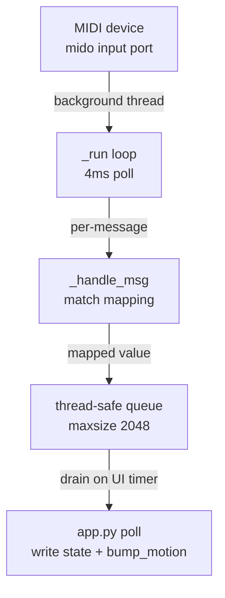

# MIDI Runtime

## Purpose
Receive MIDI CC and Note messages from hardware and map them to slum state keys in real time.
The runtime runs on a background thread so the UI thread is never blocked by port I/O.

## Architecture



The key design: the MIDI thread only puts `{target, value, mode}` dicts into the queue.
The UI timer drains the queue and writes to `state[target]`. This keeps the engine call
on the main thread.

## Configuration (`cfg.midi`)
Stored in `data/settings.json` under the `midi` key.

| Field | Type | Description |
|---|---|---|
| `enabled` | bool | Enable/disable the runtime |
| `device` | str | MIDI input device name (from `mido.get_input_names()`) |
| `channel` | int \| null | Global channel filter (1–16), null = accept all |
| `mappings` | list | Per-control mapping rules (see below) |

## Mapping schema (per entry in `cfg.midi.mappings`)

| Field | Values | Description |
|---|---|---|
| `id` | int | Unique mapping ID (used for toggle state + smoothing memory) |
| `enabled` | bool | Skip this mapping when false |
| `source` | `cc` \| `note` | Message type to listen for |
| `cc` | int 0–127 | CC number (when source=cc) |
| `note` | int 0–127 | Note number (when source=note) |
| `channel` | int 1–16 \| null | Per-mapping channel override; null = inherit global |
| `target` | str | State key to write (e.g. `cap_alpha`, `brown_mix`) |
| `min` | float | Value when input=0 |
| `max` | float | Value when input=127 |
| `mode` | `replace` \| `add` \| `multiply` | How the mapped value is applied to state |
| `curve` | `linear` \| `smoothstep` \| `ease_in` \| `ease_out` | Input response curve |
| `smoothing` | 0.0–1.0 | EMA smoothing (0=off, higher=slower) |
| `toggle` | bool | If true, note/CC triggers a flip between min and max |

## Value mapping pipeline (per incoming message)
1. Read raw value (0–127 for CC, velocity for note).
2. Normalize: `t = raw / 127.0` (clamped 0–1).
3. Apply curve: smoothstep, ease_in, ease_out, or pass through.
4. Map to range: `mapped = min + t * (max - min)`.
5. Apply smoothing (EMA): `mapped = prev + (mapped - prev) * (1 - smoothing)`.
6. Emit `{target, value, mode}` to queue.

For `toggle` source: on any non-zero input, flip internal state between `min` and `max`.
No normalization step for toggles.

## Drain and apply (app.py)
```python
# called on a UI timer (e.g. every 50ms)
updates = midi_runtime.drain_updates()
for u in updates:
    target = u["target"]
    value  = u["value"]
    mode   = u["mode"]
    if mode == "replace":
        state[target] = value
    elif mode == "add":
        state[target] = state.get(target, 0.0) + value
    elif mode == "multiply":
        state[target] = state.get(target, 1.0) * value
bump_motion()
```

## Status dict (`midi_runtime.status()`)
```python
{
    "enabled": bool,
    "active": bool,          # thread is running + port open
    "device": str | None,
    "channel": int | None,
    "last_error": str | None,
    "last_msg_ts": float | None,   # epoch timestamp of last message
    "last_update_ts": float | None,
    "queue_size": int,
}
```

## Suggested 8-knob bank (from routing_tab.md)
For a compact hardware surface mapped to the most expressive slum controls:

| Knob | Target key | Role |
|---|---|---|
| 1 | `gain` | Global motion intensity |
| 2 | `threshold` | Gate: how much motion passes |
| 3 | `memory` | Hysteresis hold / lag |
| 4 | `decay` | How fast memory fades |
| 5 | `smoothing` | Jitter removal / slew |
| 6 | `fov_scale` | Overall visual span |
| 7 | `brown_step_scale` | Travel distance |
| 8 | `brown_turn_noise` | Chaos / randomness |

## Hardware controllers tested / planned
- **MPC Live 2** (Controller Mode): class-compliant USB MIDI device, CC + Note.
- **Arduino pot + button** (serial bridge): maps analog pot to CC via serial line;
  see `docs/obsidian/05_integration/hardware_controller.md` for the circuit and sketch.

## Key files
- `engine/midi_runtime.py`
- `ui/app.py` (drain loop and apply logic)
- `ui/tabs/routing_tab.py` (MIDI device selector and mapping UI)
- `data/settings.json` → `midi.*`
