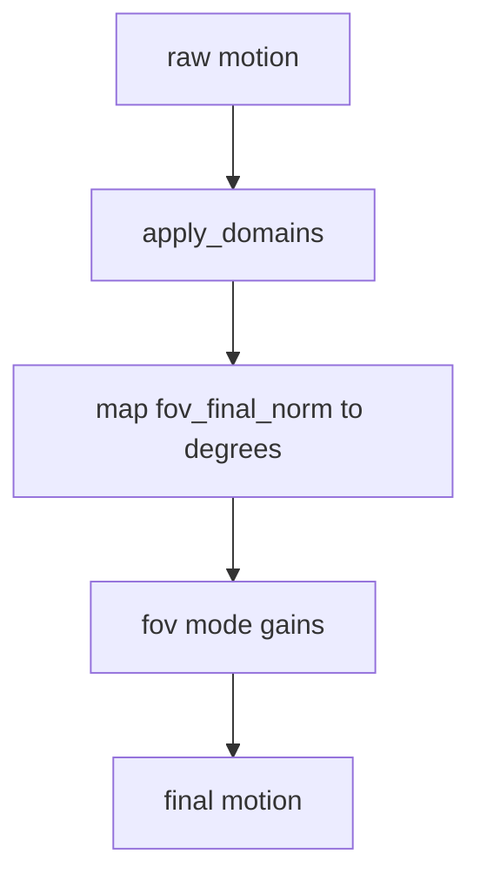

# Temporal and Domains

## Temporal controls
- `engine/temporal.py` defines resampling, aliasing, and smoothing.
- FOV has per-route aliasing and optional smoothing in routing config (FOV-only).
- Current smoothing is gaussian and expects a sigma in frames (legacy key `temporal_smooth_sigma`).

## Domains
Domains allow post-processing normalization and constraints on specific signals. They are applied in `engine/motion.py` after routing.

## Flow

## Key files
- engine/temporal.py
- engine/domains.py
- engine/motion.py
