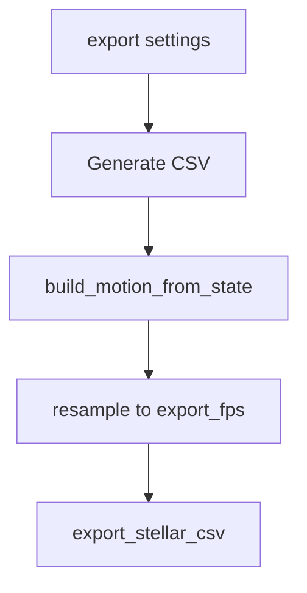

# CSV Export

## Summary
CSV export writes time-aligned motion columns at export FPS. Required columns are `FOV`, `Az`, `Alt`. Optional columns can be included via checkboxes in Settings.

## Flow

## Columns
Required:
- FOV (degrees)
- Az (radians, derived from azimuth degrees)
- Alt (radians, derived from altitude degrees)

Optional (current UI):
- az_raw, alt_raw
- dx, dy
- cart_x, cart_y, cart_z (derived from FOV + Az/Alt when requested)
- fov_final_norm, fov_geom_norm, fov_medium_norm, fov_hyst_norm
- brown_source, brown_energy01, brown_volatility, brown_step
- spectral_flux

## Notes
- Export uses the final mixed `az/alt` values. When brownian is enabled, `Az/Alt` reflect the mix, and `az_raw/alt_raw` track the mixed raw values.
- Row count is based on the `fov` array; shorter columns are padded with NaN.
- Settings → Export can auto-include view-specific keys based on the current trajectory mode and FOV source.
- SVG export lives in Settings → Export → SVG and writes `motion.svg` using the current trajectory mode/FOV source.

## Key files
- ui/tabs/settings_tab.py
- ui/csv_export.py
- engine/controller.py
