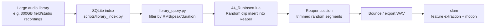

# 44 — Reaper Sample Tool (Integration with Slum)

## What 44 is
44 is a parallel project that lives in the same repo. It is a Reaper ReaScript tool for
randomly selecting and inserting audio clips from a large library into a Reaper session.
It is **not** a motion engine — it is an audio content generator and browser whose outputs
can become inputs to slum.

The name "44" refers to the project directory and the broader ecosystem of tools being built
around the slum engine.

## Role in the ecosystem

The flow is deliberate: 44 produces **concrete audio segments** from a library that might be too
large or too unstructured to feed directly into slum. A bounced or rendered segment from 44 is
then loaded into slum as a WAV file for full feature extraction, training, or live motion.

## Current implementation (Lua scripts in `docs/reaper/`)

### `44_Settings.lua`
ReaImGui panel. Stores settings in Reaper's ExtState (persistent between sessions).

Controls:
- `folderPath` — root library folder (recursive scan)
- `clipsToInsert` — number of clips per run (1–64)
- `maxClipLength` — max clip duration in seconds (1–600)
- `minPeakThreshold` — placeholder silence gate (not real silence detection yet)

### `44_RunInsert.lua`
The clip insertion runner. Reads settings from ExtState and:
1. Recursively enumerates WAV/MP3/FLAC files under `folderPath`.
2. Picks random files (`math.random`).
3. Inserts each as a new track at the next available slot (aligned to `maxClipLength` grid).
4. Trims item to `maxClipLength` at a random start offset within the file.
5. Retries up to `6 × clipsToInsert` times to reach the target clip count.

Slot alignment ensures clips don't overlap and each run appends cleanly after previous content.

### `44_BrowseFolder.lua`
Thin helper: opens a JS_ReaScriptAPI folder picker and saves the path to ExtState.
Falls back to manual text entry if JS_ReaScriptAPI is not installed.

## Planned evolution (from `docs/reaper/README.md`)

### Library index (V2)
Replace the recursive file scan with a pre-built SQLite index:
- Per-file: `path`, `duration_s`, `sample_rate`, `channels`, `peak_db`, `rms_db`, `mtime`.
- Built by `scripts/library_index.py`, queried by `scripts/library_query.py`.
- Supports incremental updates (mtime + size change detection).
- Makes filtering by duration/RMS/peak instant without re-opening files.
- Index path: `sonolumos_v3/data/library_index.sqlite`.

### Volume gate (V2)
Silence thresholds live in `sonolumos_v3/data/settings.json` under `library.volume_gate`:
- `silence_db`, `min_active_ratio`, `peak_db_min`.
- Applied during indexing; clips failing the gate are excluded from query results.

### OSC integration (future)
Planned endpoints (no-op stubs for now):
- `/slum/reaper/scan` — trigger index rebuild
- `/slum/reaper/insert` — trigger run insert
- `/slum/reaper/config` — set run parameters

These would allow slum to drive 44 directly — for example, requesting a new batch of clips
to train on without leaving the slum UI.

## Feedback fitness loop (future)
After clips are inserted and a Reaper session is assembled, a lightweight analysis + human
rating loop can learn what combinations of clips work well. See
`[[02_data_flow/reaper_feedback_fitness]]` for the design.

The long-term goal: 44 becomes a **trained curator** that selects clips matching the
expressive intent of the current slum genome — not just a random sampler.

## Practical usage today
1. Copy Lua files from `docs/reaper/` into Reaper's Scripts folder.
2. Run `44 Settings` to set the library folder and clip parameters.
3. Run `44 Run Insert` to populate the Reaper session with random clips.
4. Bounce/export the relevant clips as WAV files.
5. Load those WAVs into slum via the Audio tab for feature extraction or training.

## Key files
- `docs/reaper/44_Settings.lua`
- `docs/reaper/44_RunInsert.lua`
- `docs/reaper/44_BrowseFolder.lua`
- `docs/reaper/README.md`
- `sonolumos_v3/data/settings.json` → `library.volume_gate`
- `sonolumos_v3/library/` (stub for future indexer Python code)

## See also
- `[[02_data_flow/reaper_feedback_fitness]]` — fitness model for clip selection
- `[[01_architecture/klc_training_model]]` — how slum training uses audio inputs
